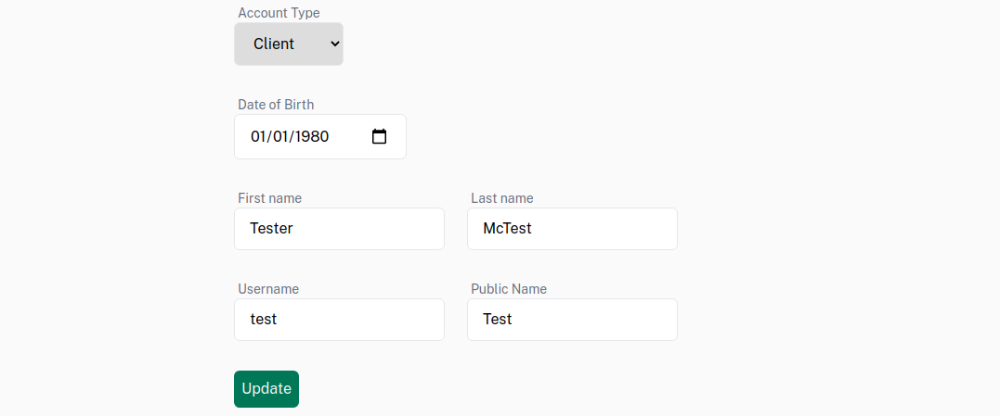

# GQL UI

Generate forms and views from your graph backend and spend less time writing
application logic. Simply define the shape of your data, and display it (views)
or edit it with CRUD ops (forms).

### Demo

Get started with the Example Project [link].

### Use

_Note: This example assumes a Dgraph backend - the only thing that will change
if you chose a different graph backend is the naming of the API methods, i.e.
`addUser` vs. `createUser` for Dgraph v. AppSync._

1. Define shape of your data:

   ```graphql
   enum State {
     AR
     AK
   }

   type Image {
     src: String!
   }

   type User {
     # The ID field for User objects is their `username` field, rather than `id`.
     username: String! @id
     name: String!
     profilePicture: Image

     # We can filter results by fields annotated with @search directive.
     state: State! @search
     numFollowers: Int @search
     numFollowing: Int @search
   }
   ```

2. A CRUD API is automatically generated by your graph backend for your types
   (`createUser`, `deleteUser`, `queryUser`, etc.)

3. Interact with the API:

   #### Views: Read/display data

   Views are used to read existing data (if any) from the backend and display
   it.

   ##### Single object, by ID

   Get single User by ID, generates a `getUser` call (here, username is the ID
   field). Select the fields provided in the `fields` attr.

   Here's how we get the User with the id (username) "tommy", and do something
   with the result, selecting only `name` and `profilePicture.src` fields.

   ```tsx
   <GqlView
     type="User"
     fields={["name", "profilePicture.src"]}
     username="tommy"
   >
     {(user) => <UserView {...user} />}
   </GqlView>
   ```

   ##### Any number of objects, from a query

   Query a list, passing the `...props` fields as filters. Here, select users
   with either `AR` or `AK` as the `User.state` variable,

   ```tsx
   <GqlFilterView
     type="User"
     fields={["name", "profilePicture.url"]}
     state={{ eq: AR, or: { eq: AK } }}
   >
     {(users) => (
       <div>
         {users.map((user) => (
           <UserView {...user} />
         ))}
       </div>
     )}
   </GqlFilterView>
   ```

#### Forms: Edit data
Forms let you mutate - **create, update, or delete** - objects in the database.
Below is form that creates a `User`.

Notice the inputs can introspect the types of the given fields, and generate
default labels ("State") and placeholders ("Enter state here") for text
inputs. They can be overridden in `GqlInput` props.

```tsx
<GqlForm type="User" method="create">
  <GqlInput field="name" />
  <GqlInput field="state" />
  <GqlInput field="dob" />
  <GqlInput field="profilePicture" />
</GqlForm>
```

##### Dynamic behavior

- `GqlForm.method = "create"` tells the form to generate a createUser mutation;
  "update" is used to modify an existing
- `User.state` is an enum: it will generate a dropdown `<select>` element
- `User.dob` is a date: it will generate a `<date>` element
- `User.profilePicture` is an image (has `src` field): will generate an S3
  bucket upload

Mandatory fields on the data model (`field: String!`) will have their input
marked `required` automatically.

##### Live fields

For `method = "update"`, the form will automatically read existing values (if
they exist) from the backend and update the input fields, so that the form
displays "live" values.

For example, the state for the form below will persist through a refresh once it
is saved, because the values will be reloaded from the backend at runtime.


